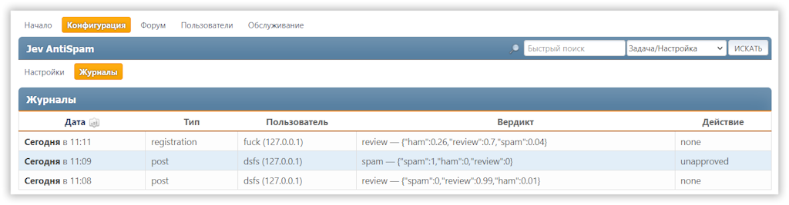
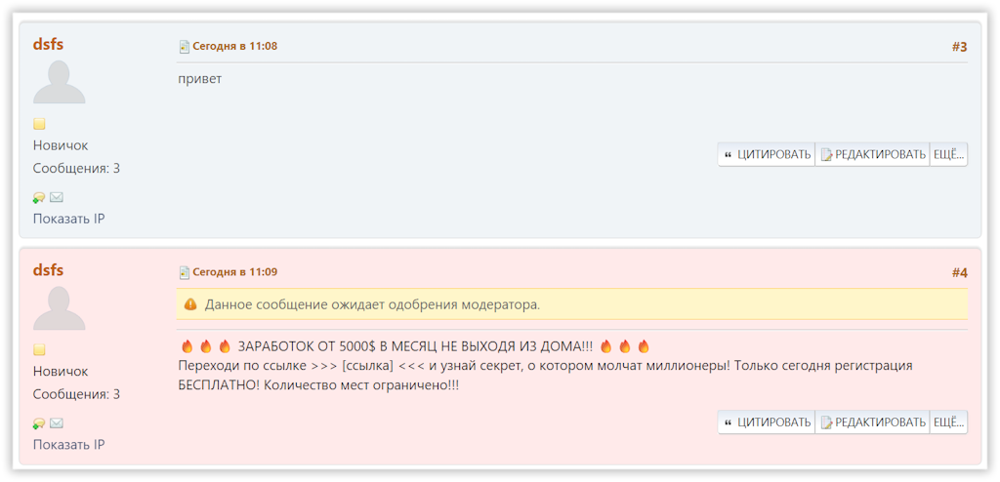
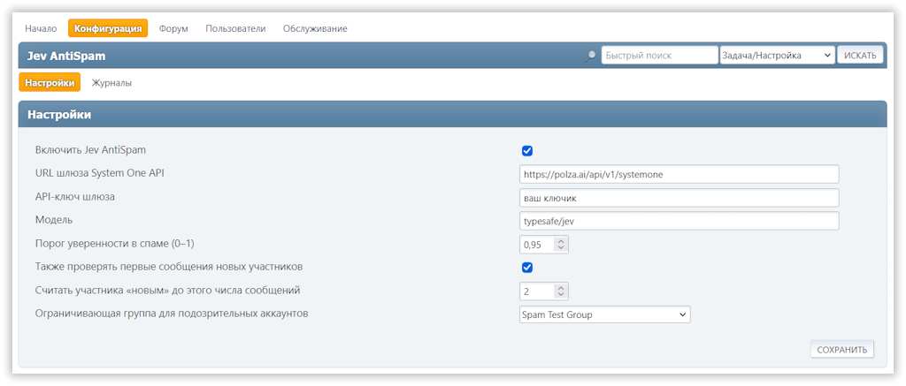

Spam Judge проверяет данные новых регистраций и первые сообщения с помощью внешнего API-шлюза ИИ. Подозрительные аккаунты можно автоматически отправлять в ограниченную группу, а сообщения — снимать с одобрения, не удаляя их.

<!-- more -->

  - :fontawesome-solid-user-shield: **Проверка регистраций**

    ---

    Классифицируйте имя пользователя и адрес электронной почты нового участника.

  - :fontawesome-solid-message: **Проверка первых сообщений**

    ---

    Не одобряйте подозрительные публикации автоматически, сохраняя их для проверки модератором.

  - :fontawesome-solid-list-check: **Журнал решений**

    ---

    Просматривайте вердикт, вероятности и выполненное действие в панели администратора.

## Как работает модификация

Для каждой проверки Spam Judge отправляет содержимое на настроенный API-шлюз. ИИ должен вернуть один из трёх результатов:

- `ham` — обычное содержимое;
- `spam` — спам;
- `review` — требуется ручная проверка.

Автоматическое действие выполняется только при результате `spam`, если вероятность спама достигла заданного порога. Если шлюз недоступен или вернул некорректный ответ, модификация работает по принципу **fail-open**: регистрация или публикация сообщения не блокируется.

## Возможности

- Классификация регистраций и первых сообщений.
- Настройка порога уверенности в спаме от `0` до `1` (по умолчанию — `0.95`).
- Перенос подозрительных новых аккаунтов в выбранную группу участников SMF.
- Снятие с одобрения подозрительных первых сообщений вместо их удаления.
- Настройка количества сообщений, до которого участник считается новым.
- Пропуск проверок для администраторов и модераторов.
- Журнал проверок в панели администратора: тип проверки, участник, вердикт, вероятности и действие.
- Сохранение в базе данных фрагмента проверенного содержимого и данных, использованных при проверке.

## Настройка

В настройках модификации укажите:

- URL API-шлюза;
- API-ключ, который будет передаваться как `Authorization: Bearer <API-ключ>`;
- название модели;
- порог уверенности в спаме;
- необходимость проверять первые сообщения;
- лимит сообщений для определения новых участников;
- ограничивающую группу для подозрительных регистраций.

По умолчанию используется модель `jev-latest`. При регистрации на шлюз отправляются имя пользователя и адрес электронной почты. При проверке сообщения передаётся текст без HTML-тегов, длиной не более 10 000 символов. В журнале сохраняются первые 500 символов проверенного содержимого.

## Совместимые шлюзы

Шлюз и модель не зашиты в модификацию. Можно использовать любой сервис, который принимает описанный в проекте формат JSON и возвращает классификацию с вероятностями.

Например, отлично работают эти 2 варианта:

- [Polza.ai](https://polza.ai/?referral=f8C85aRMPd) — `https://polza.ai/api/v1/systemone`, модель `typesafe/jev`
- [Codiv](https://codiv.ai) — `https://api.codiv.ai/v1/systemone`, модель `openjev-latest`

А эти нужно тестировать:

- [Experiential Labs](https://www.experientiallabs.ai/) — `https://api.experientiallabs.ai/v1/systemone`, модель `jev-latest`
- [Jev AI](https://jevmodel.org/how-to-use-jev/) — `https://api.typesafe.ai/v1/systemone`, модель `jev-latest`
- [Vercel AI Gateway](https://vercel.com/changelog/ai-gateway-now-supports-typesafe-clients-and-http-api-for-jev) — `https://ai-gateway.vercel.sh/typesafe`, модель `typesafe-ai/jev`

## Требования

| Требования к серверу |
| -------------------- |
| PHP с расширениями `cURL` и `mbstring` |
| Настроенный совместимый API-шлюз |

## Конфиденциальность

Модификация передаёт стороннему сервису данные регистрации, содержимое сообщений и идентифицирующую информацию. До включения Spam Judge проверьте условия обработки данных выбранного провайдера и соответствие использования политике конфиденциальности форума и применимому законодательству, включая GDPR.

{{ github('https://github.com/dragomano/smf-spam-judge') }}
